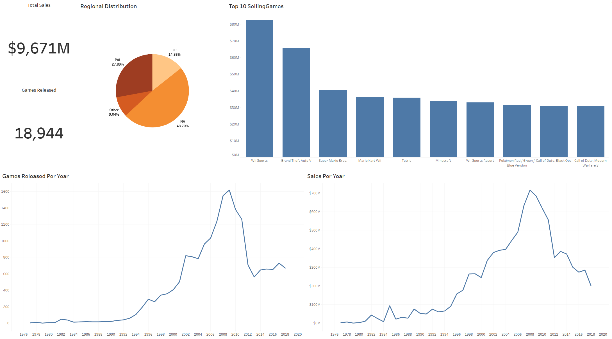
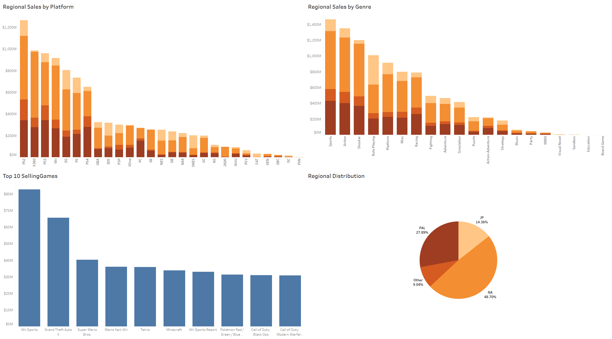

# [Project 1: VGChartz Data Exploration](https://github.com/gpecorino/Vgchartz_Data_Exploration)
This project analyzes historical trends in video game sales to generate actionable insights and recommendations for video game companies, as well as to develop a machine learning model for predicting future trends. Data was sourced from the [VGChartz.com](https://www.vgchartz.com/games/games.php?page=1&results=1000&order=TotalSales&ownership=Both&direction=DESC&showtotalsales=1&shownasales=1&showpalsales=1&showjapansales=1&showothersales=1&showpublisher=1&showdeveloper=1&showreleasedate=1&showlastupdate=0&showvgchartzscore=0&showcriticscore=1&showuserscore=1) public database using Python for web scraping. Data exploration and the machine learning model were conducted and stored in a Jupyter Notebook. All findings were consolidated and organized into interactive [Tableau dashboards](https://public.tableau.com/app/profile/giovanni.pecorino/viz/VGChartzvDashboards/SalesOverview?publish=yes), summarizing all findings and enabling deeper exploration of the data. 

## Sales Overview Dashboard 
## Regional Sales Dashboard 

# [Project 2: Northwind Data Visualizations](https://github.com/gpecorino/Northwind-Data-Visualizations)
This project uses a combination of SQL and Tableau to create useful visualization dashboards and draw conclusions about Northwind Traders' business. I first used PostgreSQL to access the Northwind Traders database, making the tables I used in my visualization and further analyzing the data. Using Tableau, I created two [Dashboards](https://public.tableau.com/app/profile/giovanni.pecorino/viz/NorthwindDashboards/SalesBreakdown?publish=yes): one looks directly at sales data, while the other focuses on employee performance. Both dashboards are interactive and give meaningful insight into the inner workings of Northwind Traders.

## Sales Breakdown Dashboard 
## Employee Performance Dashboard 
