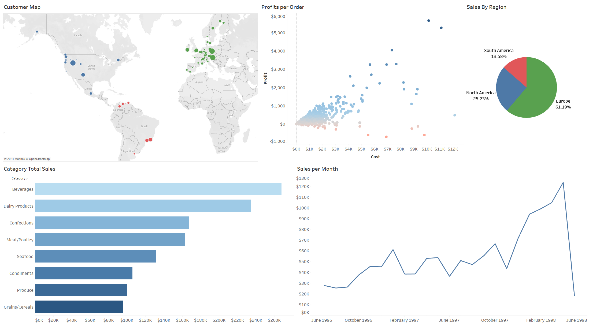
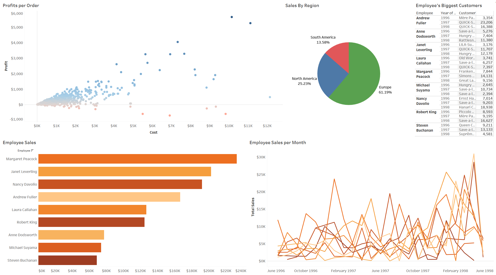

# [Project 1: VGChartz Data Exploration](https://github.com/gpecorino/Vgchartz_Data_Exploration)

This project analyzes historical trends in video game sales to generate actionable insights and recommendations for video game companies, as well as to develop a machine learning model for predicting future trends. A [Python script](https://github.com/gpecorino/Vgchartz_Data_Exploration/blob/main/vgchartz_webscrape.py) was used to web scrape the data from the [VGChartz](https://www.vgchartz.com/games/games.php?page=1&results=1000&order=TotalSales&ownership=Both&direction=DESC&showtotalsales=1&shownasales=1&showpalsales=1&showjapansales=1&showothersales=1&showpublisher=1&showdeveloper=1&showreleasedate=1&showlastupdate=0&showvgchartzscore=0&showcriticscore=1&showuserscore=1) public database. Data exploration and the creation of the machine learning model were conducted within a [Jupyter Notebook](https://github.com/gpecorino/Vgchartz_Data_Exploration/blob/main/vgchartz_eda_ml.ipynb). Finally, all findings were consolidated and organized into interactive [Tableau dashboards](https://public.tableau.com/app/profile/giovanni.pecorino/viz/VGChartzvDashboards/SalesOverview?publish=yes), facilitating a deeper exploration of the data.

## Sales Overview Dashboard 
## Regional Sales Dashboard 

# [Project 2: Northwind Data Visualizations](https://github.com/gpecorino/Northwind-Data-Visualizations)

This project leverages SQL and Tableau to develop insightful visualization dashboards that analyze Northwind Traders' business performance. [PostgreSQL quieries](https://github.com/gpecorino/Northwind_Data_Analysis/blob/main/northwind_queries.sql) were used to access the Northwind Traders database to create the necessary tables for visualization, conduct in-depth data analysis, and manage inventory effectively. The final deliverables consist of two interactive [Tableau dashboards](https://public.tableau.com/app/profile/giovanni.pecorino/viz/NorthwindDashboards/SalesBreakdown?publish=yes): one focused on sales data and the other on employee performance. Both dashboards facilitate comprehensive exploration of the data, leading to valuable insights and actionable business recommendations for Northwind Traders.

## Sales Breakdown Dashboard 
## Employee Performance Dashboard 
