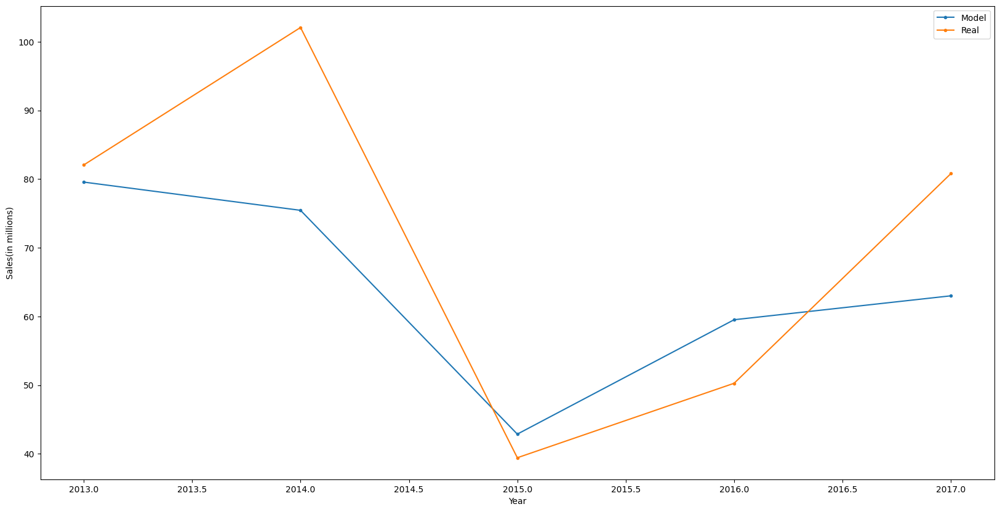

# [Project 1: VGChartz Data Exploration](https://github.com/gpecorino/Vgchartz_Data_Exploration)
This project analyzes trends in video game sales history to draw meaningful observations and create a model that can help predict future trends. First, I use Python to scrape through the [VGChartz.com](https://www.vgchartz.com/games/games.php?page=1&results=1000&order=TotalSales&ownership=Both&direction=DESC&showtotalsales=1&shownasales=1&showpalsales=1&showjapansales=1&showothersales=1&showpublisher=1&showdeveloper=1&showreleasedate=1&showlastupdate=0&showvgchartzscore=0&showcriticscore=1&showuserscore=1) public database to pull the data that will be analyzed. Next, I dive into the data and create visualizations that help bring the data to life. This data is then put into a machine-learning model to predict future sales trends. 

## Model Predictions vs Original Data 

# [Project 2: Northwind Data Visualizations](https://github.com/gpecorino/Northwind-Data-Visualizations)
This project uses a combination of SQL and Tableau to create useful visualization dashboards and draw conclusions about Northwind Traders' business. I first used PostgreSQL to access the Northwind Traders database, making the tables I used in my visualization and further analyzing the data. Using Tableau, I created two [Dashboards](https://public.tableau.com/app/profile/giovanni.pecorino/viz/NorthwindDashboards/SalesBreakdown?publish=yes): one looks directly at sales data, while the other focuses on employee performance. Both dashboards are interactive and give meaningful insight into the inner workings of Northwind Traders.

## Sales Breakdown Dashboard 
## Employee Performance Dashboard 
