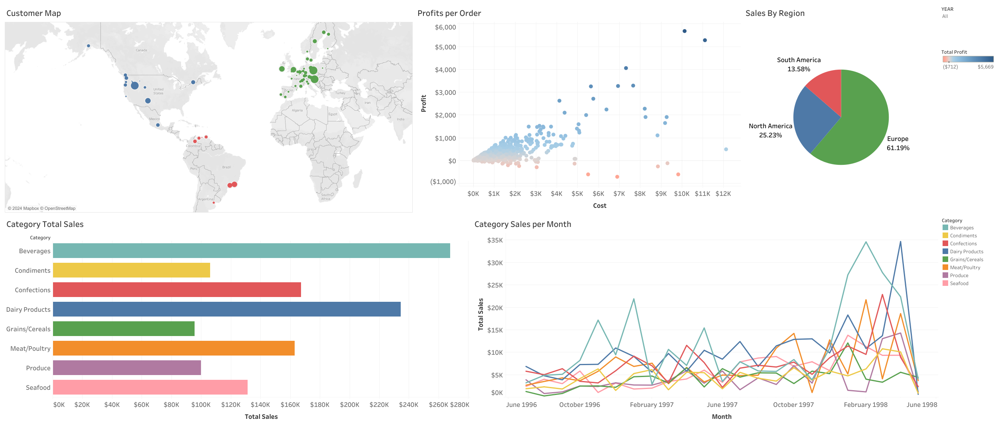
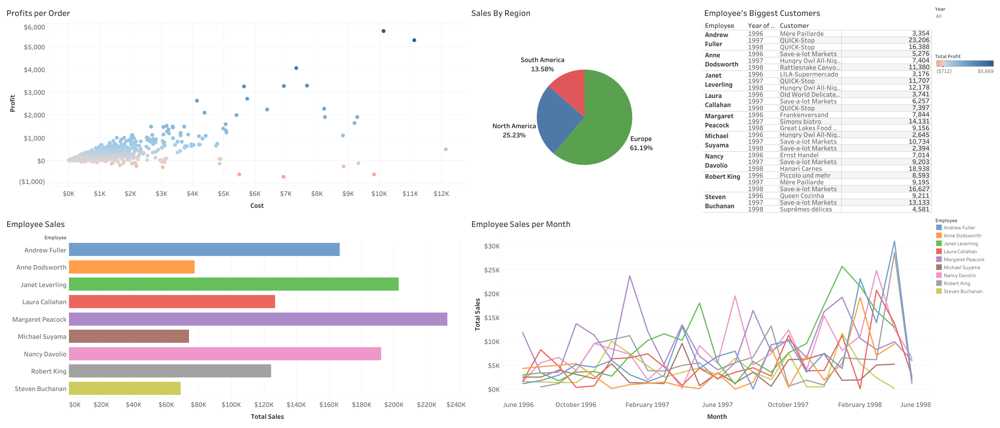

# Giovanni's Portfolio
Here you will data analytic projects that I have completed as well as links to their respective repositories that contain full breakdowns of the project and all code used in it.

# [Project 1: VGChartz Data Exploration](https://github.com/gpecorino/Vgchartz_Data_Exploration)
This project analyzes trends in video game sales history to draw meaningful observations from and to create a model that can help to predict future trends. This is done by first using python to scrape through the [VGChartz.com](https://www.vgchartz.com/games/games.php?page=1&results=1000&order=TotalSales&ownership=Both&direction=DESC&showtotalsales=1&shownasales=1&showpalsales=1&showjapansales=1&showothersales=1&showpublisher=1&showdeveloper=1&showreleasedate=1&showlastupdate=0&showvgchartzscore=0&showcriticscore=1&showuserscore=1) public database to pull the data that will be analyzed. Next I use python to dive into the data and create visualizations that help to bring the data to life. This data is then put into a machine learning model to predict future trends in sale

# [Project 2: Northwind Data Exploration](https://github.com/gpecorino/Northwind-Data-Exploration)
This project uses a combination of SQL and Tableau to create useful visualization dashboards and draw conclusions about Northwind Traders business. I first used PostgreSQL to access the Northwind Traders database; creating the tables I used in my visualization and to do further analysis on the data. Using Tableau I created [2 Dashboards](https://public.tableau.com/app/profile/giovanni.pecorino/viz/NorthwindDashboards/SalesBreakdown?publish=yes), one looks directly at sales data while the other one focuses on employee performance. Both dashboards are interactive and give meaningful insight into the inner workings of Northwind Traders.

## Sales Breakdown Dashboard 
## Employee Performance Dashboard 
